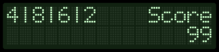
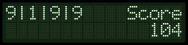
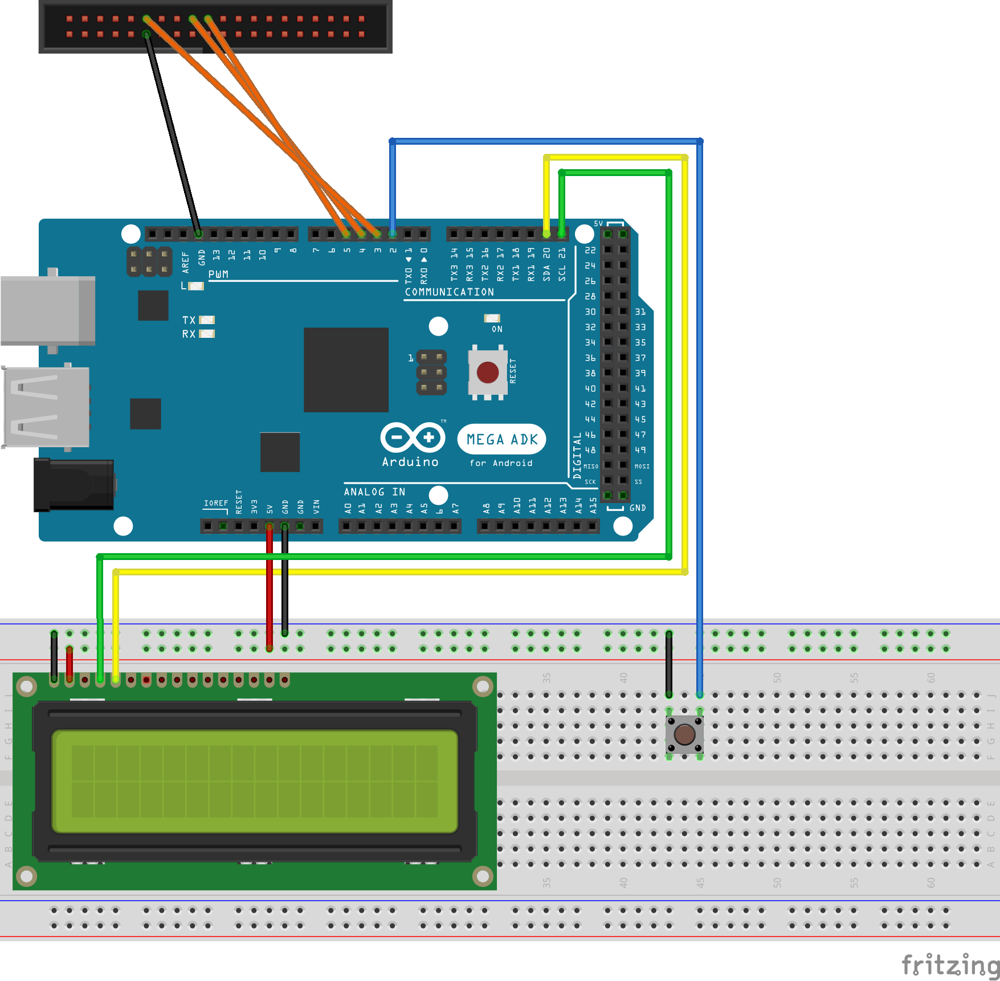
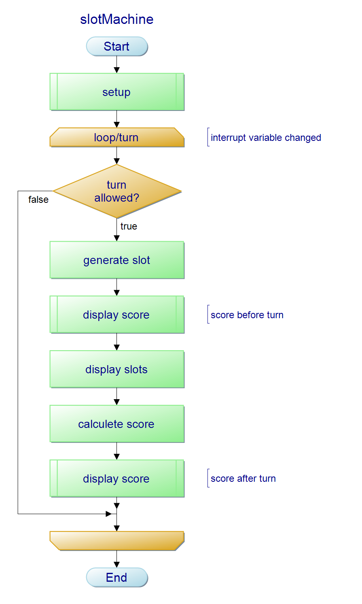

# slotMachine🎰
An open source project turning a Arduino Mega and a floppy drive into a gambling machine.

## User Manual

### How to play?
1. At first, you need to make sure that the Arduino is ready. You can reset it via the onboard reset pin.
2. Just Press the slot button to spin the slot machine.
3. You can go for other rounds, as long as you have credits left.

### Display layout
In the top LCD line the slots are displayed, while the score is displayed in the bottom right corner.
The slots consist of four numbers in the range from 0-9, that are randomly generated by the software.

### Scoring system
A game spin costs `1` credit. The spin can result in four diffrent situations.
Three possibilities mean a win for the player, while only one means a loss.

### 0 simmelar slots (loose)

| Cost | Win | Revenue |
|:----:|:---:|:-------:|
|   1  |  0  |  **-1** |

### 2 simmelar slots (small win)

| Cost | Win | Revenue |
|:----:|:---:|:-------:|
|   1  |  1  |  **0**  |

### 3 simmelar slots (medium win)

| Cost | Win | Revenue |
|:----:|:---:|:-------:|
|   1  |  5  |  **4**  |

### 4 simmelar slots (large win)

| Cost | Win | Revenue |
|:----:|:---:|:-------:|
|   1  |  50 |  **49** |

## Technical realization

### Circuit diagram

*For further information please refer to the documentation in Fritzing.*

### Program flowchart

### Source code
*This project is written in Arduino (C++) and fully commented in the english language.*

The basic program `loop()` structure is the following:
- The spin button is connected to an ineterrupt pin and debounced via software.
- An active press sets a global bool variable to poll in the `loop()` function.*
- In the next step a turn routine is started if enough credits are available.
- The code then generates four random digits with the `random()` function.
- After the generation process the LCD prepares for displaying the slots
- Then the slots are counted and the score is calculated.
- Afterwands the new score is displayed on the LCD next to the last slots.

The header/global and `setup()` defines/includes the following:
- Includes the `Wire.h` and `LiquidCrystal_I2C.h` librarys
- Includes the self written header-file for the sound of our slotmachine by [@MaxWotsch](https://github.com/MaxWotsch)
- Defines and initializes the LCD display and floppy drive
- Defines the buttons input pin and assign it's interrupt
- Defines buttons debounce interval and the delay time to display turns
- Defines variables to store multiple states of the `millis()` function
- Defines global variables to save the slots (as an array) and the score
- Initializes a random seed to provide 'radnom' results to the `random()` function
- Initializes the LCD display and plays a startup routine sound on the floppy drive
- Displays a empty game without slots and a reset value for the score

*This workaround is needed, because we cannot use an interrupt function while a I2C bus (LCD display) is active.

----

*Gambling can be addictive, please play responsibly. For help visit the Gambling page of the German BZgA. Underage gambling is an offence.
[slotMachine](https://github.com/master4x/slotMachine) is an open source project created by [@MaxWotsch](https://github.com/MaxWotsch) & [@master4x](https://github.com/master4x), released under the MIT license.*
